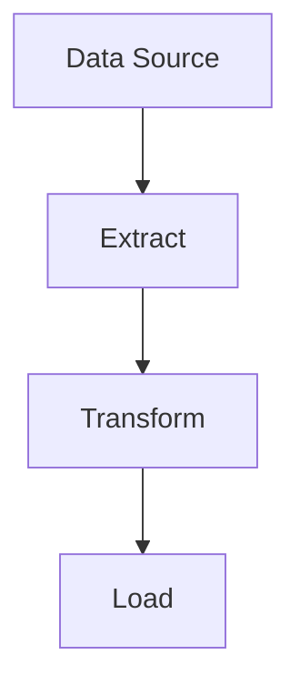

# Olorin
Olorin is a Rust based ETL tool

The first iteration is still in the works and planning to deploy it somewhere towards the end of December 2024

## Architecture
The initial plan is to match the three phases of the ETL (Extract, Transform, Load) cycle in a pipeline like format. You will define each phase in a yaml file. The data will be passed in between phases in a Dataframe like format that is yet to be determined (most likely apache arrow). 

## Why Rust to build an ETL tool
I have a very strong opinion that ETL tools should be as performant as possible. That is why I am baffled that so many are written in Python. Python is slow, not type safe, prone to undefined errors, and needs a ton of optimization to even match what most compiled languages are by default.This is probably why when Apache released Spark it was an instant hit. An big data ETL tool that was written in Scala (a JVM language) that took advantage of several philosophies of Scala (scalability, functional programming, lazy evaluation). Anyway, I am learning Rust and what better way to do so than by building a tool that can automate a lot of my day-to-day tasks and something I am interested in: Big Data. 

